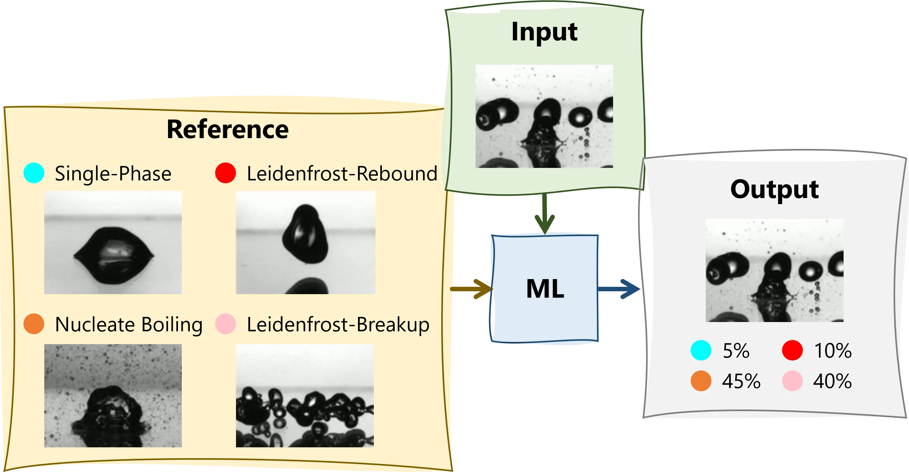

# Postgraduate Project Catalogue (2026/2027): Yutaku Kita
**Department of Engineering, King's College London**

**Academic Advisor:** Dr Yutaku Kita (yutaku.kita@kcl.ac.uk)  

---

## Quick Links to Each Project
* [Project 1: Techno-Economic and Solar-Thermal Feasibility of Photovoltaic-Driven Domestic Air Conditioning in the UK](#project-1-techno-economic-and-solar-thermal-feasibility-of-photovoltaic-driven-domestic-air-conditioning-in-the-uk)
* [Project 2: Techno-Economic and Thermal Assessment of Data Centre Liquid Cooling Systems](#project-2-techno-economic-and-thermal-assessment-of-data-centre-liquid-cooling-systems)
* [Project 3: Thermal Modelling and Active Cooling Scheme Evaluation in Wire Arc Additive Manufacturing (WAAM)](#project-3-thermal-modelling-and-active-cooling-scheme-evaluation-in-wire-arc-additive-manufacturing-waam)
* [Project 4: Machine Learning Driven Drop Impact Regime Identification](#project-4-machine-learning-driven-drop-impact-regime-identification)
* [Project 5: Data-Driven Drop Impact Regime Mapping and Interactive Visual Database Development](#project-5-data-driven-drop-impact-regime-mapping-and-interactive-visual-database-development)
* [Project 6: Student-Proposed Topic in Thermofluids and Energy Systems](#project-6-student-proposed-topic-in-thermofluids-and-energy-systems)

---

## Project 1: Techno-Economic and Solar-Thermal Feasibility of Photovoltaic-Driven Domestic Air Conditioning in the UK
Driven by recent extreme heatwaves and shifting UK climate frameworks, this project investigates the viability of using residential rooftop solar PV to directly power domestic air conditioning (AC). The student will model the thermodynamic alignment between summer solar irradiance profiles and the cooling loads of a typical UK residential dwelling. The study will assess if peak solar generation removes the need for expensive battery storage or night-time grid reliance, factoring in the UK's unique, rapid evening temperature drops.

<figure>
  
  <figcaption><a href="https://solarvisionai.com/solar-air-conditioner-efficiency-energy-savings/" target="_blank">Image source</a></figcaption>
</figure>

### Deliverables
* Dynamic building thermal load model aligned with UK solar irradiance time-series datasets.
* Techno-economic sensitivity matrix mapping capital investment vs. grid dependence vs. carbon offset.
* Strategic feasibility report aligned with the UK's £15B "Warm Homes Plan".

### Equipment / Software required to carry out this project
* MATLAB/Simulink
* Excel / Financial assessment toolkits

### Skills developed in carrying out this project
Solar microgeneration modeling, building transient heat load forecasting, Lifecycle Cost Analysis (LCCA), Net Present Value (NPV) calculation, and policy-level engineering strategy.

### Skills required to carry out this project
Solid understanding of solar thermal systems and building heat gains, paired with standard engineering economics knowledge.

---

## Project 2: Techno-Economic and Thermal Assessment of Data Centre Liquid Cooling Systems
### Description
As data centres transition from air to direct-to-chip liquid cooling to manage dense AI compute loads, infrastructure managers face immense financial and thermal trade-offs. The student will develop a system-level thermodynamic loop model of a facilities-level cooling system to analyze heat rejection rates and pumping penalties. The student will also explore the feasibility of emerging two-phase flow cooling (flow boiling, sprays).

<figure>
  
  <figcaption><a href="https://datacenters.google/discover-more/photo-gallery/" target="_blank">Google Datacentres</a></figcaption>
</figure>

### Deliverables
* A system-level thermal performance model of a direct-to-chip liquid loop (MATLAB/Simulink).
* A comprehensive CAPEX/OPEX decision-making matrix for high-density compute infrastructure deployment.

### Equipment / Software required to carry out this project
* MATLAB/Simulink

### Skills developed in carrying out this project
Closed-loop thermodynamic cycle design, heat exchanger effectiveness evaluation ($\epsilon$-NTU), power usage effectiveness (PUE) mapping, and operational infrastructure asset management.

### Skills required to carry out this project
Advanced thermodynamics, heat transfer (convective heat transfer coefficients, fluid friction factors) and basic system modeling principles.

---

## Project 3: Thermal Modelling and Active Cooling Scheme Evaluation in Wire Arc Additive Manufacturing (WAAM)
### Description
Wire Arc Additive Manufacturing (WAAM) enables the production of large-scale structural metal components. However, its economic viability is bottlenecked by process downtime. To prevent excessive heat accumulation and subsequent geometric distortion, previously deposited material must cool below a critical interlayer threshold before the next pass can begin. Under standard ambient air-cooling conditions, this waiting time can account for up to 90% of the total manufacturing cycle time, drastically inflating production costs.

This project uses computational simulation to model and evaluate advanced cooling strategies designed to mitigate this bottleneck. The student will develop a transient thermal finite element model of a multi-layer WAAM deposition process featuring a moving volumetric heat source. Using this numerical baseline, the student will evaluate and compare the thermal dissipation performance of standard natural convection (ambient air) against forced cooling techniques, specifically focusing on high-efficiency spray cooling. The spray cooling will be implemented by programming spatially and temporally varying convective heat transfer coefficients ($h$) that track behind the moving heat source.

<iframe width="560" height="315" src="https://www.youtube.com/embed/LJKMVZVoGtc?si=u875udpdF7oSRCjO" title="YouTube video player" frameborder="0" allow="accelerometer; autoplay; clipboard-write; encrypted-media; gyroscope; picture-in-picture; web-share" referrerpolicy="strict-origin-when-cross-origin" allowfullscreen></iframe>

### Deliverables
* A validated transient thermal FEA model (Ansys or COMSOL) featuring a moving arc heat source and switchable boundary conditions representing different cooling regimes (ambient air vs. active spray cooling).
* Temperature-history profiles and cooling curves ($dT/dt$) extracted at critical localized nodes across consecutive layers.
* A comparative process-time analysis matrix quantifying the exact waiting time reductions achieved by transitioning from air cooling to spray cooling.
* A project management cost-benefit analysis report evaluating the trade-off between the capital expense (CAPEX) of installing spray-cooling hardware versus the operational expense (OPEX) savings from reduced machine downtime.

### Equipment / Software required to carry out this project
* Ansys Multiphysics / Ansys Additive Suite or COMSOL Multiphysics [Metal Processing Module](https://www.comsol.com/metal-processing-module) (Cost TBC)
* Excel / Financial assessment toolkits

### Skills developed in carrying out this project
Advanced transient finite element thermal modeling, implementation of moving heat sources, modeling of multiphase convective heat transfer coefficients ($h$), cycle-time estimation, and manufacturing production cost-benefit forecasting.

### Skills required to carry out this project
Strong foundations in transient conduction and forced convection heat transfer, and previous introductory exposure to FEA software environments.

---

## Project 4: Machine Learning Driven Drop Impact Regime Identification
### Description
The impingement of liquid droplets onto heated substrates is a foundational mechanism in high-flux two-phase cooling techniques such as spray cooling. The physical outcomes of these impacts depend on a complex parameter space, including fluid-solid thermophysical properties, droplet diameter, impact velocity, and initial surface temperature. Researchers traditionally map these outcomes onto a Weber number-versus-temperature phase diagram spanning distinct regimes: single-phase cooling, nucleate boiling, the Leidenfrost state, inertial breakup, and thermal atomisation. However, visual classification by human operators is inherently subjective, particularly near regime boundaries.

This project aims to develop an objective, machine learning-driven framework to automate and quantify regime identification. Utilizing an existing repository of high-speed experimental footage, the student will preprocess video frames to train a convolutional neural network (CNN) or a deep-learning video classifier. Rather than outputting a binary classification, the model will be designed to yield a probabilistic matching percentage (e.g., 70% nucleate boiling, 30% Leidenfrost) at transition boundaries. The final framework will process unseen experimental data to generate a quantitative, probability-contoured regime map.

<figure>
  
  <figcaption>Machine Learning Driven Drop Impact Regime Identification</figcaption>
</figure>

### Deliverables
* A curated, labeled image/video dataset parsed from raw high-speed experimental droplet impact footage.
* A functioning, trained machine learning model architecture (e.g., CNN or ResNet variant) deployed in Python.
* A probabilistic matching dashboard that outputs the percentage breakdown of regimes for any uploaded impact clip.
* An upgraded quantitative droplet impact phase diagram mapping the probabilistic transition zones.

### Equipment / Software required to carry out this project
* Python 3.x with deep learning libraries (TensorFlow/Keras or PyTorch)
* OpenCV for video processing and frame extraction
* Pre-existing KCL Thermofluids lab high-speed droplet impact video database

### Skills developed in carrying out this project
Advanced computer vision, deep learning architecture implementation, image/video preprocessing pipelines, multi-class probabilistic classification, and the application of data science to multiphase thermofluid analysis.

### Skills required to carry out this project
Strong Python programming background (prior exposure to data science libraries like NumPy/Pandas is highly beneficial), a clear understanding of multiphase boiling curves (heat transfer), and basic knowledge of image processing.

---

## Project 5: Data-Driven Drop Impact Regime Mapping and Interactive Visual Database Development
### Description
When a liquid droplet impinges upon a heated solid surface, its hydrodynamic and thermal behaviors, ranging from nucleate boiling and splashing to the Leidenfrost state, are dictated by a complex interplay of kinetic, surface, and thermal energies. While substantial literature exists, the experimental datasets remain decentralised. The research group currently utilises a structured system of individual JSON files to store dataset variables (temperatures, velocities, Weber numbers, liquid types, and substrate properties) for individual papers, alongside a Python script to compile and map the results.

This postgraduate project focuses on scaling this existing infrastructure into a deployment-ready web application and expanding the data library. The student will write a data ingestion pipeline that aggregates the decentralized JSON files into a unified, queryable data framework. To streamline data expansion from new literature, the student will develop a semi-automated digitizing tool to extract data coordinates directly from published graphs and output them into the group's standardized JSON format. Finally, the student will build an interactive web-based dashboard using Streamlit/Plotly. Users will be able to filter by fluid-substrate combinations and dynamically select their axes (e.g., $We$ vs. $T$, or $Re$ vs. $T$) to generate custom droplet impact regime maps instantly.

### Deliverables
* An optimized Python script that automatically parses, validates, and aggregates the distributed library of JSON files into a unified runtime dataframe.
* A functional data-harvesting tool (leveraging Python image processing or digitization APIs) that allows users to click on literature plot images and automatically format the extracted coordinates into the standardized group JSON template.
* A live-hosted GUI dashboard featuring drop-down menus for liquid/substrate filtering and axis variable selection, rendering dynamic interactive scatter plots with probabilistic transition zones.
* A standalone, comprehensive developer manual and deployment guide. This document must include clean, commented codebases, an API/function architecture layout map, step-by-step instructions for future team members to ingest new JSON datasets, and operational guidelines for hosting maintenance.
* A management-focused technical report documenting the application architecture, data validation protocols, UX design metrics, and an engineering analysis of regime boundary discrepancies identified across the aggregated literature.

### Equipment / Software required to carry out this project
* Python 3.x Development Environment (Anaconda / VS Code)
* Python Libraries (Pandas, NumPy, Plotly, JSON module, OpenCV/WebPlotDigitizer API)
* Streamlit Web Framework and Web Cloud Hosting Server

### Skills developed in carrying out this project
Data engineering and serialization pipeline design (JSON manipulation), GUI/UX product development, software asset management, technical documentation and user guide writing, automated data harvesting/image digitization, and multi-variable thermodynamic system analysis.

### Skills required to carry out this project
Strong programming foundation in Python (specifically dictionary manipulation, file I/O, and plotting), literature survey and analysis, understanding of fluid mechanics and heat transfer, and an interest in clean software formatting.

---

## Project 6: Student-Proposed Topic in Thermofluids and Energy Systems
### Description
This slot is reserved for highly motivated students who wish to pursue a specific research question, computational study, or software tool development of their own design. The proposed topic must align tightly with the supervisor’s core expertise in thermofluids, heat transfer, multi-phase flows, or thermal energy management.

### Deliverables
To be mutually agreed upon during the scoping phase, adhering strictly to the department's assessment criteria.

### Equipment / Software required to carry out this project
The project must utilize existing institutional software licenses (Ansys, COMSOL, MATLAB) or open-source coding frameworks (Python). No bespoke hardware fabrication will be funded.

### Skills developed in carrying out this project
Dependent on the approved topic.

### Skills required to carry out this project
Dependent on the approved topic.

---