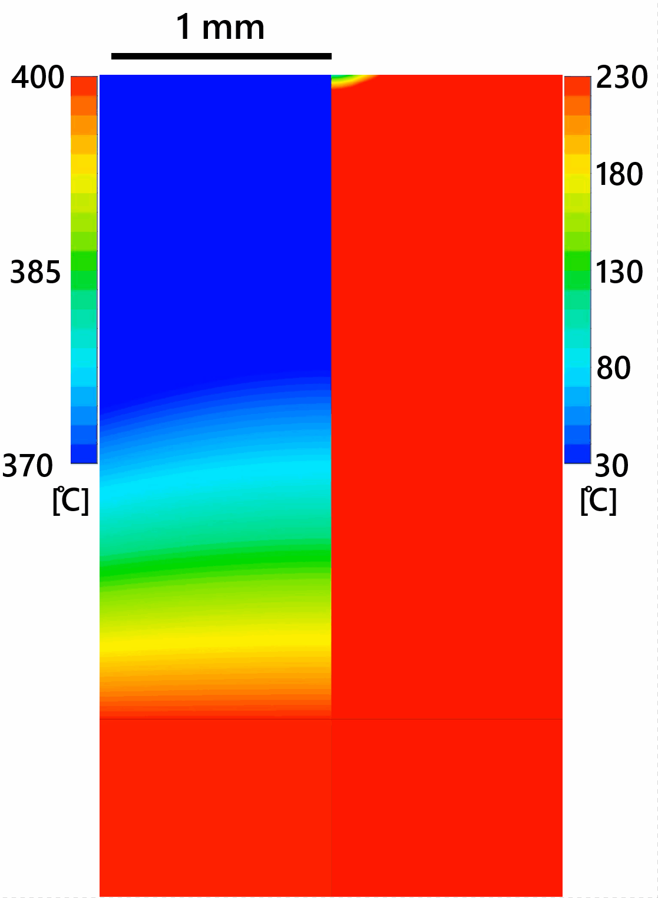

# Undergraduate Project Catalogue (2026/2027): Yutaku Kita
**Department of Engineering, King's College London**

**Academic Advisor:** Dr Yutaku Kita (yutaku.kita@kcl.ac.uk)  

---

## Quick Links to Each Project
* [Project 1: Optimising the Hanging Layout of a Laundry Drying Rack (Experimental)](#project-1-optimising-the-hanging-layout-of-a-laundry-drying-rack-experimental)
* [Project 2: Optimising the Hanging Layout of a Laundry Drying Rack (Computational)](#project-2-optimising-the-hanging-layout-of-a-laundry-drying-rack-computational)
* [Project 3: Visualising Conduction in Culinary Steakes (Experimental)](#project-3-visualising-conduction-in-culinary-steakes-experimental)
* [Project 4: CFD Simulation of Droplet Impingement Dynamics and Heat Transfer (Computational)](#project-4-cfd-simulation-of-droplet-impingement-dynamics-and-heat-transfer-computational)
* [Project 5: Multi-Layer Transient Conduction and Dynamic Boiling Model for the Differential Quenching of a Katana (Computational)](#project-6-interactive-web-based-heat-transfer-visualiser-computational)
* [Project 6: Interactive Web-Based Heat Transfer Visualiser (Computational)](#project-6-interactive-web-based-heat-transfer-visualiser-computational)

---
Project 6: Student-Proposed Topic in Thermofluids and Energy Systems
## Project 1: Optimising the Hanging Layout of a Laundry Drying Rack (Experimental)
### Description
This project investigates how the spatial distribution, orientation, and spacing of wet clothes on a standard household drying rack affect local evaporation rates. The student will build a hardware prototype to map the micro-climate surrounding the rack over time, determining the most efficient hanging configuration to reduce indoor drying times.

<figure>
  
  <figcaption><a href="https://www.grattan.co.uk/products/tower-3-tier-concertina-airer-with-fold-out-hanger-hooks/_/A-74J444_" target="_blank">Clothes drying rack.</a></figcaption>
</figure>

### Deliverables
* A functioning Arduino-based multi-point sensor grid.
* Spatio-temporal heat maps of humidity and temperature gradients around the rack.
* An optimised "hanging guide" based on empirical drying rate data.

### Equipment / Software required to carry out this project
* 1x <a target="_blank" href="https://thepihut.com/products/arduino-uno-r4-wifi">Arduino Uno R4 WiFi (£26.10)</a>
* 9x <a target="_blank" href="https://thepihut.com/products/am2302-wired-dht22-temperature-humidity-sensor">AM2302 (wired DHT22) temperature-humidity sensor (£117.00)</a>
* 1x Standard folding clothes rack (airer) (£20.00)
* Arduino IDE Software (Open-source, Free)

### Skills developed in carrying out this project
Hardware prototyping, sensor calibration, data logging, statistical data analysis, and empirical heat/mass transfer mapping

### Skills required to carry out this project
Basis knowledge of thermodynamics, heat and mass transfer (phychrimetrics and evaporation) and introductry coding logic.

---

## Project 2: Optimising the Hanging Layout of a Laundry Drying Rack (Computational)
### Description
A companion computational study to the experimental project. The student will use computational fluid dynamics to simulate natural convection and species transport (water vapor mass fraction) around simplified geometries representing wet hanging fabrics. The objective is to evaluate how localized air stagnation zones form and validate optimal spacing strategies numerically.

### Deliverables
* Validated 2D/3D CFD models of coupled heat and mass transfer driven by humidity distributions and evaporative cooling.
* Parametric sweep analysis comparing fabric spacing against local mass transfer coefficients.

### Equipment / Software required to carry out this project
* ANSYS Fluent or COMSOL Multiphysics

### Skills developed in carrying out this project
Advanced CFD mesh generation, multi-component fluid flow modeling, species transport simulation, and numerical validation methods.

### Skills required to carry out this project
Heat and mass transfer dundamentals, familiarity with partial differential equations, and introductory experience with CAD/CFD tools.

---

## Project 3: Visualising Conduction in Culinary Steakes (Experimental)
### Description
This project explores transient heat conduction within complex, asymmetrical geometries using an agar-gel food mock-up (representing steak/meat). The gel will be embedded with thermochromic liquid crystal (TLC) paint. When subjected to a boundary heat flux via a hot plate, the real-time color transitions will allow the student to map the progression of the thermal front and calculate thermal diffusivity.

<figure>
  
  <figcaption><a href="https://ocw.mit.edu/courses/2-051-introduction-to-heat-transfer-fall-2015/" target="_blank">Heat transfer knowledge will help you grill a perfect steak.</a></figcaption>
</figure>

### Deliverables
* Dynamic calibration curve for the TLC paint color-to-temperature transition.
* High-speed video analysis tracking the moving isotherm contours.
* Analytical or 1D numerical validation of the transient conduction front.

### Equipment / Software required to carry out this project
* 1x <a target="_blank" href="https://www.sfxc.co.uk/products/thermochromic-pigment-red-50c?variant=57634151727491">SFXC Thermochromic Pigment Red 50 °C 10 g (£11.95)</a>
* 1x <a target="_blank" href="https://www.sfxc.co.uk/collections/thermochromic-pigment-powder/products/sfxc-blue-31c-thermochromic-pigment">SFXC Thermochromic Pigment Blue 28 °C 10 g (£8.40)</a>
* 1x <a target="_blank" href="https://www.fishersci.co.uk/shop/products/agar-powder-14/11479632">Thermo Scientific Chemicals Agar powder 100 g (£35.65)</a>
* 1x Custom acrylic sheet casing/mold (£20)
* ImageJ, MATLAB Image Processing Toolbox, or Python

### Skills developed in carrying out this project
Optical thermal diagnostics, image processing, material characterization, and analytical transient conduction modeling.

### Skills required to carry out this project
Core heat transfer fundamentals (Fourier's Law, Biot and Fourier numbers) and laboratory safety awareness.

---

## Project 4: CFD Simulation of Droplet Impingement Dynamics and Heat Transfer (Computational)
### Description
Droplet impingement on high-temperature surfaces is a fundamental process of spray cooling for power devices, steelmaking, and emergency core cooling. This project utilizes Volume of Fluid (VOF) modeling to capture the precise phase boundary interfaces of a single fluid droplet hitting a hot solid surface. Specifically focusing on the transient thermal response of the solid substrate, the student will evaluate the effects of the Weber number, Reynolds number, substrate thermal properties on the local Nusselt number.

<figure>
  
  <figcaption>Sample simulation.</figcaption>
</figure>

### Deliverables
* High-resolution VOF simulations capturing droplet spreading, recoiling, or splashing phases.
* Transient surface heat flux profiles extracted during the millisecond-scale impact duration.
* Predictive correlation for Nu number.

### Equipment / Software required to carry out this project
* Ansys Fluent or COMSOL Multiphysics

### Skills developed in carrying out this project
Optical thermal diagnostics, image processing, material characterization, and analytical transient conduction modeling.

### Skills required to carry out this project
Core heat transfer fundamentals (Fourier's Law, Biot and Fourier numbers) and laboratory safety awareness.

---

## Project 5: Multi-Layer Transient Conduction and Dynamic Boiling Model for the Differential Quenching of a Katana (Computational)
### Description
The katana is a legendary sword that was first used by the Japanese samurai worriers several centuries ago. It is perhaps most recognisable for its curved shape and remarkably sharp single edge. One of the secrets that make katanas unique is the coating of clay over the blade before thermal treatment: this controls the boiling transition, providing differential cooling rates between the blade and spine. Building on a <a target='_blank' href='https://www.comsol.com/blogs/modeling-the-differential-quenching-of-a-katana?wvideo=k1ldm7a7vl#multiphysics-of-heat-treatment'>COMSOL Blog post</a>, the student will develop a high-fidelity numerical model that solves transient conduction through the clay layer, coupled with dynamic boiling heat transfer coefficient boundary conditions (switching from film boiling to nucleate boiling based on empirical correlations) at the clay-water interface.

<a href="https://www.comsol.com/blogs/modeling-the-differential-quenching-of-a-katana?wvideo=k1ldm7a7vl#multiphysics-of-heat-treatment">Modeling the Differential Quenching of a Katana | COMSOL Blog</a>

### Deliverables
* A multi-domain, coupled 2D/3D thermal model resolving the clay-steel boundary interface.
* Implementation of logic-based switching functions for the boiling regimes based on transient clay surface temperature.
* Spatio-temporal katana deformation, phase, and cooling profiles.

### Equipment / Software required to carry out this project
* COMSOL Multiphysics
  * Heat Transfer Module
  * Structural Mechanics Module
  * <a target="_blank" href="https://www.comsol.com/metal-processing-module">Metal Processing Module (Cost TBC)</a>

### Skills developed in carrying out this project
Equation-based modeling, phase-change boundary layer modeling, programming conditional logical functions within FEA software, and metallurgical thermo-mechanical analysis.

### Skills required to carry out this project
Deep understanding of the boiling heat transfer (Leidenfrost effect, nucleate boiling), basic metallurgy, and prior introductory exposure to COMSOL or FEA workflows.

---

## Project 6: Interactive Web-Based Heat Transfer Visualiser (Computational)
### Description
This project bridges thermofluid physics and software engineering to develop an open-access, browser-based educational web application. The application will serve as an interactive visual toolkit for undergraduate engineering students. It will consist of two distinct core computation modules:

1. Transient Conduction Module: A lightweight 2D Finite Difference Method (FDM) partial differential equation (PDE) solver. Users can graphically "draw" or select custom 2D geometric shapes, choose materials or set thermal properties (density, specific heat, and conductivity), apply distinct boundary conditions (temperature, heat flux, or convection), and animate the transient heat equation over time.
2. Boundary Layer Module: A numerical solver for the Blausius and Pohlhausen ordinary differential equations (ODEs), allowing users to adjust the Reynolds ($Re$) and Prandtl ($Pr$) numbers to watch velocity and thermal boundary layers grow in real time.

### Deliverables
* A live-deployed, open-source web application with an intuitive graphical user interface (GUI).
* Integrated, optimized Python or JavaScript solvers capable of real-time mathematical plotting.
* An accompanying user manual outlining the underlying numerical schemes (CFL stability constraints, similarity solutions) and a verification report comparing app outputs to analytical baseline solutions.

### Equipment / Software required to carry out this project
* Python 3.x Development Environment (Anaconda / VS Code)
* Streamlit Web Application Framework
* NumPy, SciPy, and Plotly/Matplotlib libraries
* Streamlit Community Cloud Hosting Server

### Skills developed in carrying out this project
Full-stack scientific software deployment, graphical user interface (GUI/UX) design, numerical discretization of partial and ordinary differential equations, implementation of numerical stability criteria (CFL condition checking), vectorization techniques for real-time mathematical animations, and code version control (Git/GitHub).

### Skills required to carry out this project
Proficient programming foundation in Python (variables, loops, arrays, functions), strong theoretical knowledge of heat transfer, and a solid mathematical understanding of finite difference numerical schemes.

---